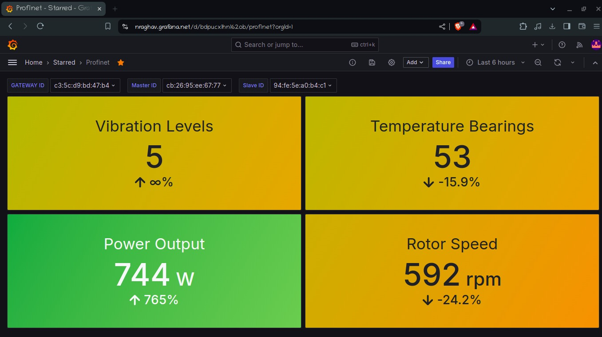

# IoT Pipeline for Industrial Protocols

Welcome to the IoT Pipeline for Industrial Protocols project! This repository contains code and documentation for building a robust IoT pipeline to handle industrial protocols. The pipeline is designed to facilitate seamless communication and data processing for industrial IoT devices.

## Table of Contents

- [Overview](#overview)
- [Features](#features)
- [Output](#output)

## Overview

This project involves the study and implementation of multiple industrial communication protocols. The primary focus is on creating an IoT pipeline and industrial adapters for the following protocols:

- CAN
- Modbus
- Profinet
- BACnet

The pipeline includes components such as master-slave communication, a gateway, a database, and a UI/UX layer for data visualization.

## Features

- Simulations for CAN, Modbus, Profinet, and BACnet protocols
- Master-slave communication model
- Gateway for data processing
- Integration with InfluxDB for data storage
- Visualization using Grafana
- RabbitMQ for message brokering hosted on a Azure Virtual Machine

## Output

